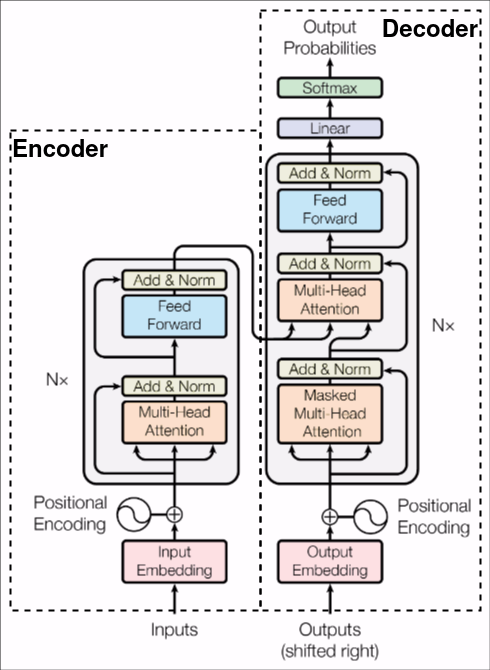
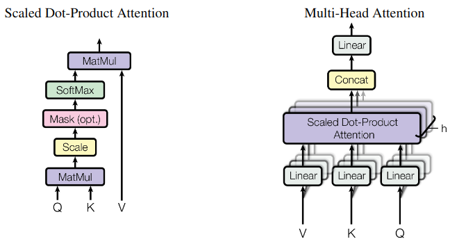

# Transformers

<div id="logo-container">
    <!-- Placeholder for logo-->
</div>


Como repaso del Transformer, este fue expuesto por primera vez en el 2017 en el paper titulado "Attention is all you need" [[1](references.md)]. En este articulo se propuso:

- Una arquitectura Encoder-Decoder.
- El mecanismo de Self-Attention.
- La expansion del Attention con Multiheaded Attention (MHA).
- La aplicacion en traduccion de lenguajes.


## Arquitectura

La arquitectura es la siguiente:



De la imagen se puede facilmente determinar las operaciones internas de la arquitectura, desglozando simplemente es:

- Embeddings.
- Multi-Head Attention.
- Suma y Norma.
- Red lineal Feed-Forward.

De los anteriores, lo relevante y nuevo para el lector es probablemente el Multi-Head Attention, vease la imagen siguiente:



Enfocandose en el mecanismo de attention, es una operacion relativamente simple, que consta de:

- Multiplicacion.
- Escalamiento.
- Mascaras.
- Softmax (Normalizacion).

El Multi-Head Attention, no es nada mas que el **Stack** de multiples operaciones de Attention en paralelo, en otras palabras es el escalamiento del attention.

Este escalamiento conlleva a proyecciones lineales de los vectores de entrada, cada proyección es la entrada de cada capa de attention, estas son concatenadas y projectadas devuelta a una dimension reducida.

En terminos formales el Attention es definido como:

$$
\text{Attention}(\mathbf{Q}, \mathbf{K}, \mathbf{V}) = \text{softmax} \left( \frac{\mathbf{Q} \mathbf{K}^T}{\sqrt{d_k}} \right) \cdot \mathbf{V}
$$

donde:

**Q**, **K**, y **V** son matrices que representan los vectores de **query**, **key**, y **value**, respectivamente.
Estas matrices son obtenidas mediante la transformación lineal de los vectores de entrada.

Por ultimo el Multihead Attention es definido como:

$$
\text{MultiHead}(\mathbf{Q}, \mathbf{K}, \mathbf{V}) = \text{Concat}(head_{1},...head_{h})W^{O}
$$
donde: 

$$
head_{i} = \text{Attention}(\mathbf{QW_{i}^{Q}}, \mathbf{KW_{i}^{K}},\mathbf{VW_{i}^{V}})
$$


# Datos de entrada

El transformer espera recibir como input secuencias de datos, en NLP los datos de entrada es texto. Este es "tokenizado" mediante un algoritmo de tokenizacion como Byte-Pair Encoding (BPE). **La tokenizacion simplemente es transformar texto a vectores representativos.** Como ejemplo vease el siguiente pseudocodigo de tokenizacion con BPE.

```python

bpe = tokenizer.BPE()

encoded = bpe.encode("hello")

print(encoded)

# Output: [104, 101, 108, 108, 111]
#           ^    ^    ^    ^    ^
#           h ,  e ,  l  , l  , o
```

Posteriormente el vector es transformado a un nuevo vector del espacio latente de los Embeddings. De esta manera los conceptos de NLP como la similitud del coseno son aplicables.

Por ultimo se agrega a los embeddings una encodificacion posicional, que originalmente no es nada mas que funciones senoidales. 

La razon es para seguir el orden de la secuencia de entrada, por lo tanto es necesario injectar informacion sobre la posicion de los tokens, esto se define de la siguiente manera:

$$
PE_{(\text{pos}, 2i)}  =\sin(\frac{\text{pos}} {{10000^{\frac{2i}{d_{model}}}}})
$$

$$
PE_{(\text{pos}, 2i + 1)}  =\cos(\frac{\text{pos}} {{10000^{\frac{2i}{d_{model}}}}})
$$

donde:

**pos** es la posicion  e **i** es la dimension.